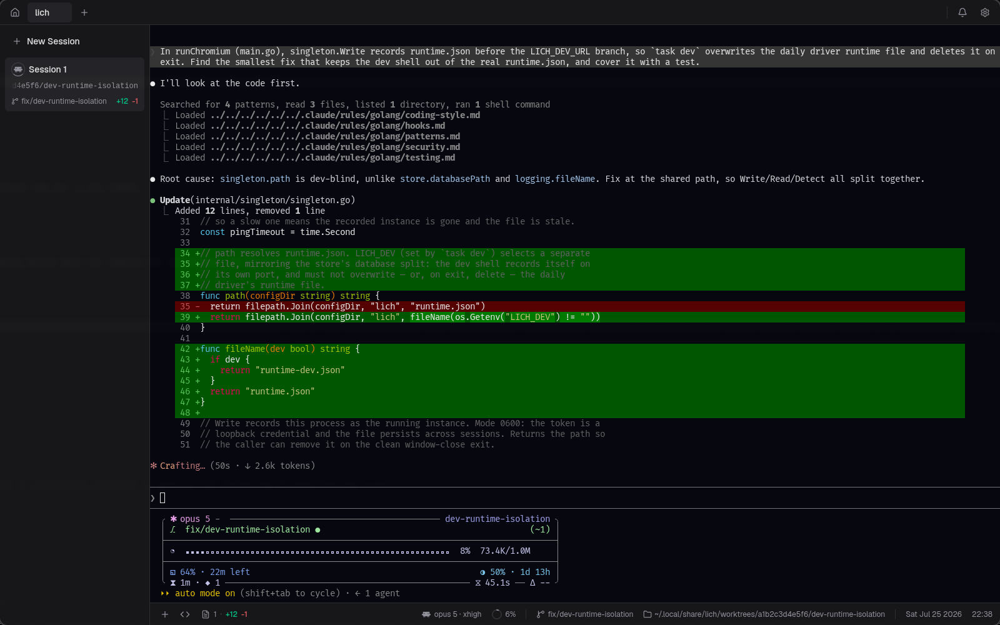

<div align="center">
  <picture>
    <source media="(prefers-color-scheme: dark)" srcset="frontend/public/appicon.png" />
    
  </picture>
  <h1>lich</h1>
  <p><strong>English</strong> · <a href="README.zh-CN.md">简体中文</a></p>
  <p><strong>A terminal-first harness for coding with AI agents.</strong></p>
  <p>
    Open your projects, run agents like Claude Code, Codex and opencode in real
    terminals, and keep git — worktrees, diffs and pull requests — in view
    without leaving the window. One static Go binary, no Electron: the UI opens
    in your system's Chromium-family browser in <code>--app</code> mode.
  </p>
  <p><a href="https://omartelo.github.io/lich/"><strong>omartelo.github.io/lich</strong></a></p>
  <p>
    <a href="https://github.com/omartelo/lich/releases"></a>
    
    
    
    <a href="LICENSE"></a>
    <a href="https://github.com/sponsors/omartelo"></a>
  </p>
  
  <!-- sponsor-logos: company logos go here, between the screenshot and Why lich -->
</div>

## Why lich

lich lets you:

- **Run the agent you already have.** [Claude Code](https://www.anthropic.com/claude-code),
  [Codex](https://github.com/openai/codex), Antigravity,
  [opencode](https://github.com/sst/opencode), oh-my-pi and
  [Crush](https://github.com/charmbracelet/crush) and the
  [Cursor CLI](https://cursor.com/docs/cli) are all first-class. Point lich at each binary once, then pick the default or choose
  per session.
- **Keep a real terminal.** PTY-backed shells, several per project, rendered on
  the GPU — searchable scrollback that survives a full page reload. Give one an
  entrypoint — `lazygit`, `k9s`, `pnpm dev` — and it opens straight into that
  tool every time. The footer follows `cd` and names the branch — and, for a
  Claude Code or Codex session, the model, the context window in use and how
  much of your plan's rolling window is left; for Claude Code, if you ask, what
  the session has spent.
- **Put one session to work for another.** Hand a task to another card and its
  own agent writes the answer back, whatever runs in either end: the agent
  reaches the other sessions through tools handed at spawn — MCP for Claude
  Code and Codex — or brought by the plugin. The whole surface doubles as the
  `lich` command in any shell, `--json` included, so a script can drive a
  session with no agent in the loop ([`docs/cli.md`](docs/cli.md)).
- **Branch off a worktree without the setup.** Spin one up from any base
  branch and lich seeds it with your gitignored `.env*` files, hands it a
  dev-server port no other checkout and no process on the machine is using, and
  runs your per-project setup script before the agent starts.
- **Run a session confined.** An agent can open inside an OS sandbox: a fresh
  empty home holding only that provider's own state, the rest of the machine
  read-only, and write access to the checkout it was opened for. Your ssh keys,
  your cloud credentials and every other repository on the disk are simply not
  there — the counterweight to letting an agent skip permission prompts. Linux
  runs bubblewrap and macOS `sandbox-exec`; it is not a boundary against hostile
  code, and [`docs/ceilings.md`](docs/ceilings.md) says what it does not stop.
- **Review the diff where you read it.** A CodeMirror dock shows the working
  changes beside a live file tree. Right-click a selection to comment against
  those lines; the batch is pasted into the session as a single prompt, unsent.
- **Ship the pull request from here.** List the repository's open pull requests,
  check one out into a worktree of its own, then read the diff, review it inline
  and merge it — with the methods the base branch actually accepts.

Plus: [themes](docs/themes.md) you import as JSON or install from a git
repository, a `Ctrl`/`Cmd`+`K` palette that jumps by name or by what was said in
the conversation, a desktop notification when a session is waiting on you, and
`lich rage` / `lich doctor` for when it will not start at all.

Development is active: bugs and feature requests belong in
[Issues](https://github.com/omartelo/lich/issues), and what changed in each
version is in [CHANGELOG.md](CHANGELOG.md).

## Install

One line — detects your distro, verifies the checksum, and installs the native
package and its dependencies through your package manager:

```bash
curl -fsSL https://raw.githubusercontent.com/omartelo/lich/main/install.sh | sh
```

| Platform | Get it | Needs at runtime |
| --- | --- | --- |
| **Linux** | `install.sh` above, or AUR [`lich-bin`](https://aur.archlinux.org/packages/lich-bin) (`yay -S lich-bin`) | chromium / google-chrome / brave on `PATH`, plus `zenity` |
| **macOS** *(experimental)* | `brew install --cask omartelo/tap/lich` | Chrome / Chromium / Edge / Brave in `/Applications` |
| **Windows** *(experimental)* | installer from [Releases](https://github.com/omartelo/lich/releases) | Chrome / Edge / Brave |

Manual per-distro packages and the static binary: [INSTALL.md](INSTALL.md). The
macOS and Windows binaries are unsigned — Gatekeeper and SmartScreen warn until
notarization/signing ship. Homebrew installs sidestep the Gatekeeper prompt;
a download from the Releases page needs its quarantine flag cleared by hand.
On macOS the cask installs `Lich.app`, so lich has its own icon in
`/Applications`; the Dock, while it runs, shows the browser that owns the
window. Upgrading from the old formula needs `brew uninstall lich` first —
[INSTALL.md](INSTALL.md) says why.

## Getting started

1. **Install** and launch `lich`.
2. **Open a project** — the `+` in the tab strip lists what you closed recently
   and opens your OS folder picker; point it at a git repository.
3. **Point lich at your agent** — the first launch lists the agents it found on
   your machine; in Global Settings › Providers you can set each binary path and
   choose the default. A project can inherit it or choose a different provider
   in Project Settings › Providers.
4. **Start a session** — *New Session* spawns a terminal running your agent in
   the project. Each checkout header also has a `+` menu for opening any enabled
   provider or a plain terminal in that exact checkout; click the header itself
   to collapse or expand its sessions.
5. **Branch off a worktree** *(optional)* — create one from any base branch;
   lich seeds it and drops you into a fresh session.

## Configuration

- **Providers** — set each provider's binary path and the global default in
  Global Settings › Providers. Project Settings › Providers can override that
  choice for one project; **Use default** removes the override, so later changes
  to the global default flow through automatically. The Claude Code and Codex
  sections open with how much of your plan is left and carry the ladder for what
  the footer says about a session — the context ring, plus the cost readout for
  Claude Code, that last rung off by default since the figure only means
  something when you are billed per token.
- **Sandbox** — a **Sandbox** ladder sits beside the permission one in each
  provider's section: Off, Ask each time, Worktrees only, Everywhere. It is per
  provider, a project can set its own, and the New worktree dialog's **Run
  confined** box overrides the rung for that session alone — every later spawn
  of it included. Linux needs bubblewrap and macOS `sandbox-exec`; the control
  is absent on a machine with neither, and on Windows.
- **Worktrees** — `.lich/setup-worktree.sh` in the project checkout runs in a
  new worktree's terminal ahead of the agent; the New worktree dialog shows it
  and offers a detected suggestion when the repo ships none. A
  `.worktreeinclude` file tunes which gitignored files get copied over.
- **Version control** — a project can name the GitHub account `gh` runs as
  (Settings › Version Control), for a repository only one of your accounts can
  see. It governs what lich reads from GitHub, not what git pushes.
- **Hotkeys** — `Ctrl`/`Cmd`+`/` lists every configurable app action, terminal
  search chord and PTY translation. Settings › Hotkeys can rebind, disable or
  reset those rows, including image attach, newline and word erase. Disabling a
  row restores native terminal behavior. Conflicts are shown, and at most one
  lich action handles a press. Zoom stays fixed outside Settings: `Ctrl`/`Cmd`
  with the physical Equal, Minus or 0 key, including their numpad equivalents
  and a character fallback for layouts with dedicated plus/minus keys.
  Browser-dangerous chords remain guarded without being stopped on their way to
  the TUI. Bindings live in the page's `localStorage`, so wiping lich's Chromium
  profile resets them.
- **Appearance** — themes and fonts in Settings; the theme you pick persists in
  the workspace database, the rest of the UI preferences in `localStorage` under
  `lich.*` keys (inside lich's Chromium profile at
  `~/.config/lich/chromium-profile`), and imported themes as JSON under
  `<config-dir>/lich/themes`.
- **Workspace** — projects and sessions persist in SQLite at
  `<config-dir>/lich/lich.db`. Closing a session does not delete it.
- **Session hooks** — with the
  [lich plugin](https://github.com/omartelo/lich-plugin) installed from Settings,
  a session titles its own card and refreshes git the moment it writes a file.

## Privacy & updates

Everything runs on your machine. No account, no sign-in, no telemetry — the
backend is a token-authenticated loopback listener, and nothing leaves
`localhost` except the update check: a version ping to GitHub Releases at startup
and hourly. Updates apply in place on Windows/macOS and through the AUR on Arch.
Settings › Help says what the log file carries — paths, project and branch names,
your gh login, never a session token — before you attach it to a bug report, and
`lich rage` collects that report into one archive without uploading any of it.

## Build from source

Pure-Go backend (Go 1.27, `CGO_ENABLED=0`) serving an embedded React 18 /
TypeScript / Vite frontend over a token-authenticated loopback listener (HTTP RPC
+ WebSockets). Terminals are xterm.js with the WebGL addon; the code and diff
surfaces are CodeMirror 6. The Chromium shell is a decision record:
[`docs/chromium-shell.md`](docs/chromium-shell.md). Prerequisites are **Go
1.27.0+**, **Node + pnpm** and **[Task](https://taskfile.dev)** — no C toolchain,
no system dev libraries.

```bash
task dev      # hot-reload dev mode (Vite on :9245)
task build    # production binary -> bin/lich
task run      # build + run
task test     # Go + frontend suites
```

Package a Linux release locally (needs
[nfpm](https://nfpm.goreleaser.com/)):

```bash
task package   # .deb + .rpm + Arch .pkg.tar.zst in bin/
```

Adding another agent CLI to the six lich runs is the one change that lands in a
dozen files across two repositories:
[`docs/adding-a-provider.md`](docs/adding-a-provider.md) is the map.

## Sponsors

lich is written and maintained by one person. Sponsoring pays for the time that
goes into it and keeps the project independent: there is no paid tier of the app
and there will not be one.

[**Become a sponsor**](https://github.com/sponsors/omartelo)

<!-- sponsor-names: monthly sponsors go here -->

### Backers

<!-- backers: one-time supporters go here -->

Nobody yet.

## License

[AGPL-3.0-only](LICENSE) © 2026 omartelo

lich is free software: you can use, study, modify and redistribute it under
the terms of the GNU Affero General Public License v3. Any distributed or
network-served derivative must be released under the same license. Releases
up to and including v0.9.0 remain MIT-licensed.
