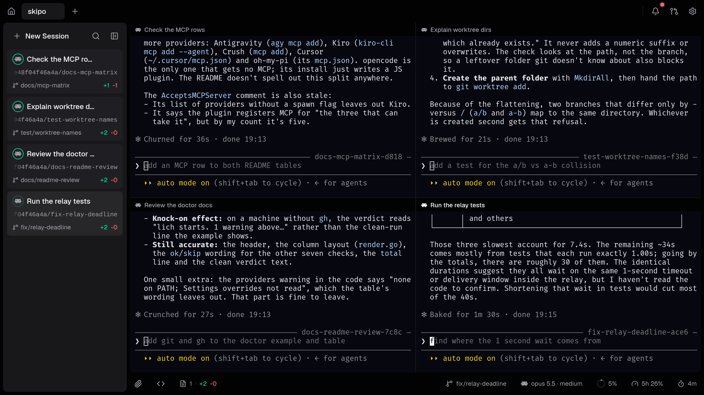

<div align="center">
  <picture>
    <source media="(prefers-color-scheme: dark)" srcset="frontend/public/appicon.png" />
    
  </picture>
  <h1>lich</h1>
  <p><strong>English</strong> · <a href="README.zh-CN.md">简体中文</a></p>
  <p><strong>A terminal-first ADE for the coding agents you already use.</strong></p>
  <p>
    Open your projects, run agents like Claude Code, Codex and opencode in real
    terminals, and keep git — worktrees, diffs and pull requests — in view
    without leaving the window. One static Go binary, no Electron: the UI
    opens in lich's own embedded Chromium on Linux, Windows and macOS.
  </p>
  <p><a href="https://omartelo.github.io/lich/"><strong>omartelo.github.io/lich</strong></a></p>
  <p>
    <a href="https://github.com/omartelo/lich/releases"></a>
    
    
    
    <a href="LICENSE"></a>
    <a href="https://github.com/sponsors/omartelo"></a>
  </p>
  
  <!-- sponsor-logos: company logos go here, between the screenshot and Why lich -->
</div>

## Why lich

lich lets you:

- **Run the agent you already have.** [Claude Code](https://www.anthropic.com/claude-code),
  [Codex](https://github.com/openai/codex), Antigravity,
  [opencode](https://github.com/sst/opencode), oh-my-pi,
  [Crush](https://github.com/charmbracelet/crush), the
  [Cursor CLI](https://cursor.com/docs/cli) and the
  [Kiro CLI](https://kiro.dev/docs/cli/) all run here the same way. Point lich
  at each binary once, then pick the default or choose per session. What lich
  can read back *out* of a session differs by provider, and
  [Provider support](#provider-support) is the table.
- **Keep a real terminal.** PTY-backed shells, several per project, rendered on
  the GPU — searchable scrollback that survives a full page reload. Give one an
  entrypoint — `lazygit`, `k9s`, `pnpm dev` — and it opens straight into that
  tool every time, on Linux, macOS and Windows alike: no shell rc or PowerShell
  profile is loaded first, so an entrypoint that works for you works for whoever
  you share it with; write your dev server into `.lich/run-worktree.sh` and every
  checkout gets a **Run** card for it, on the port lich reserved for that
  worktree. The footer follows `cd` and names the branch — and, for a
  Claude Code, Codex or Kiro CLI session, the model and the context window in
  use; for Claude Code, Codex, Antigravity, Cursor CLI and an OpenCode Go
  subscription, how much of your plan's rolling window is left; if you ask, what
  the session has spent, on the providers that record it.
- **Put one session to work for another.** Hand a task to another card and its
  own agent writes the answer back, whatever runs in either end: the agent
  reaches the other sessions through tools handed at spawn — MCP for Claude
  Code and Codex — or brought by the plugin. The whole surface doubles as the
  `lich` command in any shell, `--json` included, so a script can drive a
  session with no agent in the loop ([`docs/cli.md`](docs/cli.md)).
- **Watch several of them at once.** Put any session on a wall beside the one
  you are in and lich lays the panes out itself, from how many there are and how
  much room the window has — eight land four across on an ultrawide and two
  across on a laptop. A session that handed work to others builds the wall around
  it in one click. Each wall is named, a project keeps as many as you like, and
  each gets a block in the sidebar you can fold, rename or take apart.
- **Branch off a worktree without the setup.** Spin one up from any base
  branch and lich seeds it with your gitignored `.env*` files, hands it a
  dev-server port no other checkout and no process on the machine is using, and
  runs your per-project setup script before the agent starts. Start it from the
  checkout's uncommitted work and those changes come along, untracked files
  included.
- **Run a session confined.** An agent can open inside an OS sandbox: a fresh
  empty home holding only that provider's own state, the rest of the machine
  read-only, and write access to the checkout it was opened for. Your ssh keys,
  your cloud credentials and every other repository on the disk are simply not
  there — the counterweight to letting an agent skip permission prompts. Linux
  runs bubblewrap and macOS `sandbox-exec`; it is not a boundary against hostile
  code, and [`docs/ceilings.md`](docs/ceilings.md) says what it does not stop.
- **Review the diff where you read it.** A CodeMirror dock shows the working
  changes beside a live file tree, folds the ones that only moved whitespace when
  you ask it to, and shows a changed image or PDF before and after. Right-click a
  selection to comment against those lines; the batch is pasted into the session
  as a single prompt, unsent. Its Code tab browses the checkout and searches the
  text of its files.
- **Ship the pull request from here.** List the repository's open pull requests,
  check one out into a worktree of its own, then read the diff, review it inline
  and merge it — with the methods the base branch actually accepts. On a branch
  with no pull request yet, **Create with agent** asks that branch's session to
  open one, and nothing is sent until you press Enter.

Plus: [themes](docs/themes.md) you import as JSON or install from a git
repository, a `Ctrl`/`Cmd`+`K` palette that jumps by name or by what was said in
the conversation, a desktop notification when a session is waiting on you, and
`lich rage` / `lich doctor` for when it will not start at all.

Development is active: bugs and feature requests belong in
[Issues](https://github.com/omartelo/lich/issues), and what changed in each
version is in [CHANGELOG.md](CHANGELOG.md).

## Provider support

Every provider is spawned in a real terminal, resumed by conversation id,
confined by the same sandbox and handed the same way of reaching your other
sessions. What differs is what lich can *read* back out of a session, because it
reads what each CLI writes down and no two of them write down the same things.

| What you get | Claude Code | Codex | Antigravity | opencode | oh-my-pi | Crush | Cursor CLI | Kiro CLI |
| --- | :-: | :-: | :-: | :-: | :-: | :-: | :-: | :-: |
| Context window in the footer | yes | yes | no | no | no | no | no | yes |
| Cost in the footer | yes | yes | no | yes | yes | yes | no | credits |
| How much of your plan is left | yes | yes | yes | OpenCode Go only | no | no | yes | no |
| A turn your plan's usage limit stopped picks up again once the limit resets | yes | yes | no | its own retries | its own retries | no | no | no |
| Spinner while a turn runs, ring when it ends | yes | yes | yes | yes | yes | no | yes | yes |
| Bell when the agent is blocked on you | yes | yes | no | yes | no | no | no | no |
| The card says when the conversation is being compacted | yes | no | no | no | no | no | no | no |
| Sidebar filter by state: Waiting, Running, Unread | yes | yes | no Waiting | yes | no Waiting | no, always Idle | no Waiting | no Waiting |
| Machine kept out of idle sleep while a turn runs | yes | yes | yes | yes | yes | no | yes | yes |
| Review tab's **Last turn**, with the agent's recap | yes | yes | yes | yes | yes | no | yes | yes |
| Search the conversation from the palette | yes | yes | yes | yes | yes | yes | no | yes |
| Resume a conversation started outside lich, from the palette's History tab | yes | yes | yes | yes | yes | Linux; macOS and Windows untested | yes | yes |
| Fork a conversation into a new worktree | yes | yes | no | yes | no | no | no | no |
| Open a session at a chosen reasoning effort | yes | yes | yes | no | yes | no | in the model name | yes |
| Open a session with ultracode on | yes | no | no | no | no | no | no | no |
| Drive a running session from `lich control` or an agent: prompt, stop, model, effort, slash command | yes | no | no | no | no | no | no | no |
| A message from another session arrives without being typed into the terminal | yes | no | no | no | no | no | no | no |
| A subagent the agent starts runs as a lich session with its own card, in the asking session's checkout, hands its full report back and closes once done; its own subagents get cards too, one level down | yes | no | no | no | no | no | no | no |
| Ask a running session a side question without stopping it (`lich ask`) | yes | no | no | no | no | no | no | no |
| Context, cost and plan usage as the CLI measured them itself | yes | no | no | no | no | no | no | no |
| The terminal's status line shows who the session owes an answer, who it is waiting on, and answers ready to collect | yes | no | no | no | no | no | no | no |
| Delegate privately from a subagent or workflow step | yes | yes | yes | yes | yes | yes | yes | yes |
| A resumed session keeps the model and effort it was on | model only | yes | no | model | yes | no | model | model; effort untested |
| A result still waits for you after you interrupt a wait for it | yes | yes | yes | yes | no | yes | yes | yes |
| A task you hand another session reports back "unanswered" as soon as that agent ends its turn without replying | yes | yes | yes | yes | yes | no, waits for the deadline | yes | yes |

Crush reports neither the start nor the end of a turn, and that is
where five of those rows go at once: nothing opens a window for the card's
spinner, for the bell, for the Review tab's last turn, for the hold that keeps
the machine awake, or for telling whoever handed it a task that the turn ended
without an answer. The Review tab says so on the session itself rather than
leaving you to notice the switch never appeared. Kiro CLI meters spend in credits
rather than dollars, so its own footer is the only place that figure can be read.
Antigravity's plan is read by asking `agy` itself (1.1.11 or newer; an older one
would spend a turn answering, so lich does not ask it); opencode's only when you
signed in to an OpenCode Go subscription, since otherwise it bills your own API
keys; Cursor CLI's from the login `cursor-agent login` wrote, never the Cursor
editor's. oh-my-pi, Crush and Kiro CLI report no plan lich can read.
Driving a running session needs Claude Code 2.1.280 or newer with lich-plugin
0.15.0: it runs through a Claude Code mod, and no other CLI has anything running
inside it that lich could hand a command to. The same mod, with lich-plugin 0.16.0,
reports what Claude Code measured about itself; every other CLI's footer, and a
Claude Code session without it, shows what lich reads from what the CLI wrote down.
The History tab's **Outside lich** group lists conversations that ran in one of
your projects' checkouts and that lich does not hold. A session lich opened and you
closed for good stays out of it, except one closed before 0.62.0: lich tells
its own Claude Code conversations apart by the name it starts them under, and the
other seven CLIs write down nothing that could tell them apart, so theirs show up
there once.

Every gap is deliberate, none of them is lich withholding something the CLI
reports, and [`docs/ceilings.md`](docs/ceilings.md) says what was measured behind
each one.

## Install

One line — detects your distro, verifies the checksum, and installs the native
package and its dependencies through your package manager:

```bash
curl -fsSL https://raw.githubusercontent.com/omartelo/lich/main/install.sh | sh
```

| Platform | Get it | Needs at runtime |
| --- | --- | --- |
| **Linux** | `install.sh` above, or AUR [`lich-bin`](https://aur.archlinux.org/packages/lich-bin) (`yay -S lich-bin`) | `zenity`, plus glibc 2.34 or newer for the window that ships in the package (Debian 12, Ubuntu 22.04, RHEL 9 and up) |
| **macOS** *(experimental)* | `brew install --cask omartelo/tap/lich` | nothing, the window ships in the app on Apple Silicon and Intel alike |
| **Windows** | installer or portable zip from [Releases](https://github.com/omartelo/lich/releases), or Scoop: `scoop install https://github.com/omartelo/lich/releases/latest/download/lich.json` | nothing, the window ships with each |

Manual per-distro packages, the Linux tarball and the Windows portable zip: [INSTALL.md](INSTALL.md). The
macOS and Windows binaries are unsigned — Gatekeeper and SmartScreen warn until
notarization/signing ship. Homebrew installs sidestep the Gatekeeper prompt;
a download from the Releases page needs its quarantine flag cleared by hand.
On macOS the cask installs `Lich.app`, so lich has its own icon in
`/Applications` and in the Dock while it runs. Upgrading from the old formula
needs `brew uninstall lich` first — [INSTALL.md](INSTALL.md) says why.

## Getting started

1. **Install** and launch `lich`.
2. **Open a project** — the `+` in the tab strip lists what you closed recently
   and opens your OS folder picker; point it at a git repository.
3. **Point lich at your agent** — the first launch lists the agents it found on
   your machine; in Settings › Providers you can set each binary path and
   choose the default. A project can follow it or choose a different provider
   on the same screen.
4. **Start a session** — *New Session* spawns a terminal running your agent in
   the project. Each checkout header also has a `+` menu for opening any enabled
   provider or a plain terminal in that exact checkout; click the header itself
   to collapse or expand its sessions.
5. **Branch off a worktree** *(optional)* — create one from any base branch;
   lich seeds it and drops you into a fresh session.

## Configuration

- **Providers** — set each provider's binary path and the default for all
  projects in Settings › Providers. The open project's row there can override
  that choice; **Clear** removes the override, so later changes to the default
  flow through automatically. A provider's section opens
  with how much of your plan is left, when lich can read it. What the footer
  shows is set in Settings › Appearance by dragging its items; the cost
  readout starts hidden, since the figure only means something when you are
  billed per token.
- **Worktrees** — `.lich/setup-worktree.sh` in the project checkout runs in a
  new worktree's terminal ahead of the agent; the New worktree dialog shows it
  and offers a detected suggestion when the repo ships none. A
  `.worktreeinclude` file tunes which gitignored files get copied over.
- **Session hooks** — with the
  [lich plugin](https://github.com/omartelo/lich-plugin) installed from Settings,
  a session titles its own card and refreshes git the moment it writes a file.
- **Stability**: which parts of lich are safe to script against, and which can
  change in any release, is written down in [docs/stability.md](docs/stability.md).

## Privacy & updates

Everything runs on your machine. No account, no sign-in, no telemetry: the
backend is a token-authenticated loopback listener. On its own, lich goes to the
network for these and nothing else:

- **Updates**: a version check against GitHub Releases at startup and hourly,
  and the lich plugin's release list on GitHub at startup.
- **Plan usage**: each provider's own usage endpoint (Anthropic, OpenAI, Cursor,
  OpenCode Go), with the login the session's CLI already uses, at most every five
  minutes. Antigravity's plan is read from `agy` itself.
- **Prices**: LiteLLM's public price table on GitHub, once for a model the
  bundled table does not know.

The Windows installer's build updates in place; a Homebrew, Scoop, AUR or Linux
package install updates through its package manager, and lich hands you the
command.
Settings › Help says what the log file carries — paths, project and branch names,
your gh login, never a session token — before you attach it to a bug report, and
`lich rage` collects that report into one archive without uploading any of it.

## Build from source

Pure-Go backend (Go 1.27, `CGO_ENABLED=0`) serving an embedded React 18 /
TypeScript / Vite frontend over a token-authenticated loopback listener (HTTP RPC
+ WebSockets). Terminals are xterm.js with the WebGL addon; the code and diff
surfaces are CodeMirror 6. The Chromium shell is a decision record:
[`docs/chromium-shell.md`](docs/chromium-shell.md). Prerequisites are **Go
1.27.0+**, **Node + pnpm** and **[Task](https://taskfile.dev)** — no C toolchain
for the Go binary. The window (`shell/`, Rust on CEF) adds a Rust toolchain,
plus Chromium's dev libraries on Linux and MSVC on Windows;
[CONTRIBUTING.md](CONTRIBUTING.md) lists them.

```bash
task dev      # hot-reload dev mode (Vite on :9245)
task build    # production binary -> bin/lich
task run      # build + run
task test     # Go + frontend suites
```

Package a Linux release locally (needs
[nfpm](https://nfpm.goreleaser.com/)):

```bash
task package   # .deb + .rpm + Arch .pkg.tar.zst in bin/
```

Adding another agent CLI to the eight lich runs is the one change that lands in a
dozen files across two repositories:
[`docs/adding-a-provider.md`](docs/adding-a-provider.md) is the map.

## Sponsors

lich is written and maintained by one person. Sponsoring pays for the time that
goes into it and keeps the project independent: there is no paid tier of the app
and there will not be one.

[**Become a sponsor**](https://github.com/sponsors/omartelo)

<!-- sponsor-names: monthly sponsors go here -->

### Backers

<!-- backers: one-time supporters go here -->

Nobody yet.

## License

[AGPL-3.0-only](LICENSE) © 2026 omartelo

lich is free software: you can use, study, modify and redistribute it under
the terms of the GNU Affero General Public License v3. Any distributed or
network-served derivative must be released under the same license. Releases
up to and including v0.9.0 remain MIT-licensed.
