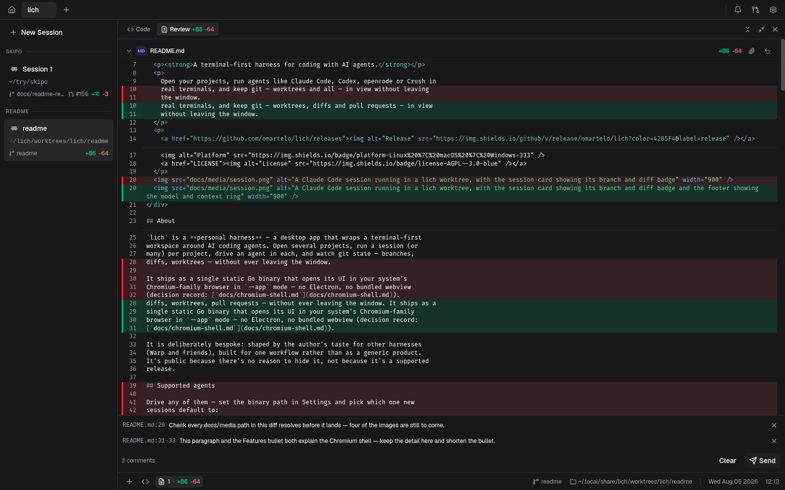
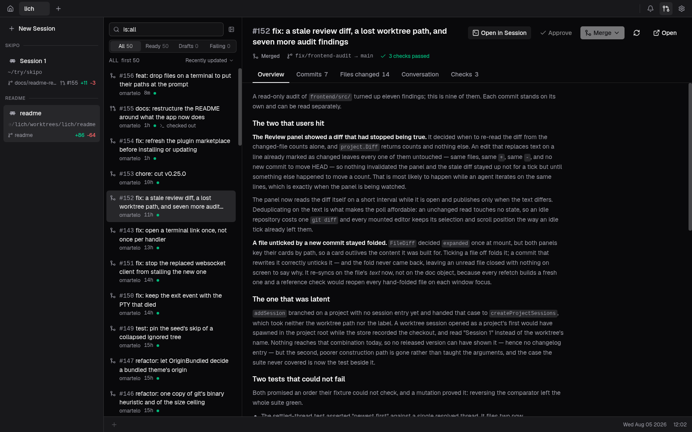
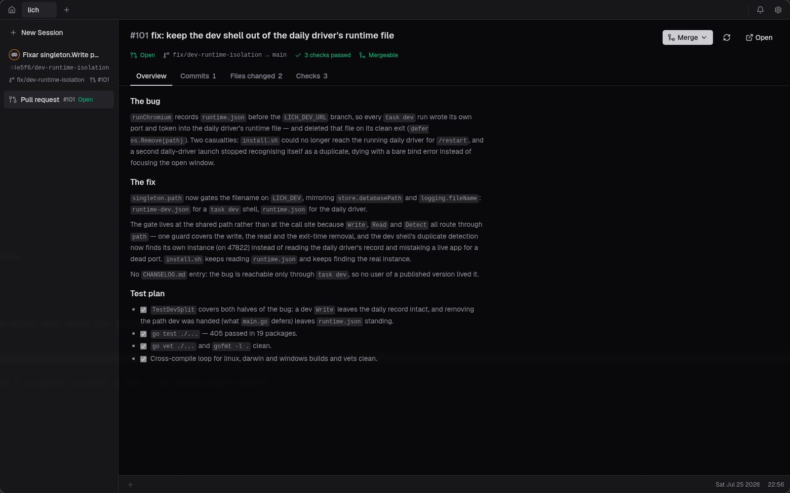
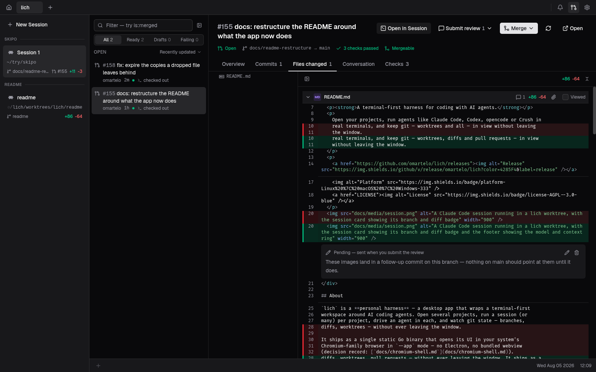
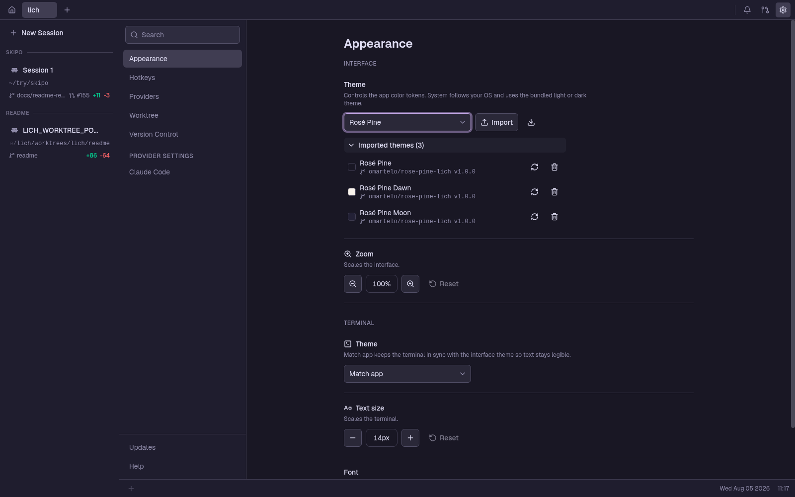

<div align="center">
  <picture>
    <source media="(prefers-color-scheme: dark)" srcset="frontend/public/appicon.png" />
    
  </picture>
  <h1>lich</h1>
  <p><a href="README.md">English</a> · <strong>简体中文</strong></p>
  <p><a href="https://omartelo.github.io/lich/index.zh-CN.html"><strong>omartelo.github.io/lich</strong></a></p>
  <p><strong>为 AI 编码智能体打造的终端优先工作台。</strong></p>
  <p>
    打开你的项目，在真实终端里运行 Claude Code、Codex、Opencode 这样的智能体，
    并把 git —— worktree、diff 和 Pull Request —— 一并留在视野里，无需离开窗口。
  </p>
  <p>
    <a href="https://github.com/omartelo/lich/releases"></a>
    
    
    
    <a href="LICENSE"></a>
  </p>
  
</div>

> 本文档译自英文 [README.md](README.md)。英文版本是唯一的事实来源；若两者出现分歧，以英文为准。

## 关于

`lich` 是一个**面向 AI 编码智能体的工作台**（harness）—— 一个把终端优先的工作区包裹在
它们外面的桌面应用。同时打开多个项目，每个项目跑一个（或多个）会话，在每个会话里驱动一个
智能体，并且始终看得见 git 的状态：分支、diff、worktree、Pull Request —— 全程不必离开
窗口。它以单个静态 Go 二进制文件的形式发布，界面在你系统自带的 Chromium 系浏览器中以
`--app` 模式打开 —— 没有 Electron，也不捆绑 webview（决策记录：
[`docs/chromium-shell.md`](docs/chromium-shell.md)）。

它的目标是不挡路 —— 终端始终是真正的终端，git 始终留在你看得见的地方。项目处于活跃开发
中：bug 和功能需求请提到 [Issues](https://github.com/omartelo/lich/issues)，每个版本改了
什么见 [CHANGELOG.md](CHANGELOG.md)。

## 特性

- **自带智能体。** [Claude Code](https://www.anthropic.com/claude-code)（Anthropic）、
  [Codex](https://github.com/openai/codex)（OpenAI）、
  [opencode](https://github.com/sst/opencode)（SST）和
  [Crush](https://github.com/charmbracelet/crush)（Charm）都是一等公民：在设置里把
  lich 指向各自的二进制文件，选一个默认的，或者逐个会话单独指定。
- **终端优先的会话。** 真正由 PTY 支撑的 shell，每个项目可以开好几个，由 xterm.js 在
  GPU 上（WebGL）渲染。可以搜索滚动缓冲区（`Ctrl+F`）；缓冲区能挺过整页刷新。Warp 风格
  的底栏跟随 `cd` 并显示 git 状态；对于 Claude 会话，它还会标明模型、用一个圆环填充已
  占用的上下文窗口，并且 —— 如果你要求的话 —— 算出这个会话花了多少钱。
- **项目与会话。** 项目位于顶部标签栏；`+` 可以重新打开你最近关掉的项目，其余的则调起
  系统的文件夹选择器。会话卡片上带着工作目录、分支、diff 徽标、未跟踪行数，以及该分支
  Pull Request 的编号。
- **内建 git worktree。** 从任意基础分支开一个 —— 本地或远程都能搜，哪怕有几十个分支
  —— lich 会把你被 gitignore 掉的 `.env*` 文件播种到新的检出目录里，按路径派给它一个
  稳定的开发服务器端口（`LICH_WORKTREE_PORT`），并在智能体启动前跑一遍按项目配置的
  初始化脚本。侧栏按会话所属的 worktree 分组，被保留下来的 worktree，其会话之后可以接着
  原来的对话恢复。
- **审查，并把审查交回去。** 一个 CodeMirror 的 diff 面板在实时文件树旁展示工作区改动
  —— 一次性折叠或展开所有文件、在你的编辑器里打开某个文件、把某个文件附加给会话。右键
  选中的内容就能针对这些行写评论；整批评论会作为一条 prompt 交出去，粘贴进会话但不发送。

<div align="center">
  
  <p><em>写在 diff 上的评论，作为一条 prompt 交给会话。</em></p>
</div>

- **Pull Request，端到端。** 标签栏上的一个按钮会列出仓库里所有开启的 Pull Request ——
  既有快捷筛选，也支持 GitHub 自己的限定符（`is:draft`、`review:approved`、`is:merged`）
  —— **Open in Session** 会把其中一个检出到它自己的 worktree 里。Pull Request 以全屏
  打开：概览、检查、提交，以及文件树旁的完整 diff。在你读它的地方就审查它 —— 讨论串会
  内联展开在它所针对的那一行下面，你自己的评论会以 pending 状态等着，直到 **Submit
  review** 把它们一起发出去 —— 批准它，然后用基础分支实际接受的方式（squash、merge
  commit 或 rebase）合并它。
- **主题，你的或别人的。** 内置浅色与深色，另外还能导入 JSON，分别给界面和终端调色板
  重新上色。从一个 git 仓库安装一套主题包，等它发布新版本时就地更新；**Save template**
  会写出一份列明所有受支持颜色的模板。格式与仓库布局见
  [`docs/themes.md`](docs/themes.md)。
- **窗口里的其余部分。** `Ctrl`/`Cmd`+`K` 在会话与项目之间跳转。某个会话在等你输入时会
  弹出一个 toast，并在铃铛上点亮一个小圆点，统一收进带标题的下拉列表；装上
  [lich 插件](https://github.com/omartelo/lich-plugin)之后，Claude 会话还会给自己的卡片
  起标题，并在它写入文件的那一刻刷新 git。设置 › 帮助可以打开日志文件夹和一份预填好的
  bug 报告。

<div align="center">
  
  <p><em>仓库的 Pull Request，用 GitHub 自己的限定符筛选。</em></p>
  
  <p><em>就地阅读、批准并合并。</em></p>
  
  <p><em>写在 diff 本身上的审查 —— 每条评论都处于 pending，直到你把它们一起提交。</em></p>
  
  <p><em>从 git 仓库安装的主题包，就地更新。</em></p>
</div>

## 安装

一行命令 —— 识别你的发行版、校验校验和，并通过你的包管理器安装原生软件包及其依赖：

```bash
curl -fsSL https://raw.githubusercontent.com/omartelo/lich/main/install.sh | sh
```

| 平台 | 安装方式 | 运行时依赖 |
| --- | --- | --- |
| **Linux** | 上面的 `install.sh`，或 AUR 的 [`lich-bin`](https://aur.archlinux.org/packages/lich-bin)（`yay -S lich-bin`） | `PATH` 上有 chromium / google-chrome / brave，外加 `zenity` |
| **macOS** *(实验性)* | `brew install omartelo/tap/lich` | `/Applications` 里有 Chrome / Chromium / Edge / Brave |
| **Windows** *(实验性)* | 从 [Releases](https://github.com/omartelo/lich/releases) 下载安装程序 | Chrome / Edge / Brave |

手动的分发版软件包和静态二进制文件见 [INSTALL.md](INSTALL.md)。macOS 和 Windows 的
二进制文件未签名 —— 在公证/签名做好之前，Gatekeeper 和 SmartScreen 会发出警告。用
Homebrew 安装可以绕开 Gatekeeper 的提示；从 Releases 页面下载的二进制文件则需要手动
清除隔离标记。

## 快速上手

1. **安装**并启动 `lich`。
2. **打开一个项目** —— 标签栏里的 `+` 会列出你最近关掉的项目，也能调起系统的文件夹
   选择器；指向一个 git 仓库即可。
3. **把 lich 指向你的智能体** —— 在设置 › Providers 里，为 Claude Code、Codex、
   opencode 或 Crush 设置二进制文件路径，并选一个默认的。
4. **开一个会话** —— *New Session* 会在项目里启动一个跑着你的智能体的终端。
5. **分出一个 worktree**（可选）—— 从任意基础分支创建一个；lich 会为它播种文件，并把你
   带进一个新的会话。

## 配置

- **智能体** —— 在设置里为每个 provider 设定二进制文件路径，并选定新会话默认用哪一个。
  Claude Code 那一节还管着底栏的上下文圆环和费用读数 —— 费用默认关闭，因为只有当你按
  token 计费时这个数字才有意义。
- **Worktree** —— 按项目配置的初始化脚本（设置 › Worktree）会在新 worktree 的终端里
  先于智能体运行；`.worktreeinclude` 文件用来调整哪些被 gitignore 的文件会被复制过去。
- **版本控制** —— 一个项目可以指定 `gh` 以哪个 GitHub 账号运行（设置 › Version
  Control），用于只有你其中一个账号看得见的仓库。它管的是 lich 从 GitHub 读到什么，
  而不是 git 推送时用谁的身份。
- **外观与快捷键** —— 主题、字体和组合键都在设置里；UI 偏好以 `lich.*` 为键持久化在
  `localStorage`（位于 lich 的 Chromium 配置目录 `~/.config/lich/chromium-profile`），
  导入的主题则以 JSON 存在 `<config-dir>/lich/themes` 下。
- **工作区** —— 项目和会话持久化在 SQLite 里，路径为 `<config-dir>/lich/lich.db`。
  关闭一个会话并不会删除它。

## 隐私与更新

一切都跑在你自己的机器上。没有账号，不用登录，没有遥测 —— 后端是一个带 token 鉴权的
本地回环监听器，除了更新检查之外没有任何东西离开 `localhost`：启动时以及每小时向 GitHub
Releases 发一次版本查询。更新在 Windows/macOS 上就地应用，在 Arch 上通过 AUR 进行。
设置 › 帮助会在你把日志附到 bug 报告之前，说明日志文件里都带了什么 —— 路径、项目名和
分支名、你的 gh 登录名，绝不包含会话 token。

## 从源码构建

纯 Go 后端（Go 1.25，`CGO_ENABLED=0`），通过带 token 鉴权的本地回环监听器（HTTP RPC +
WebSocket）伺服内嵌的 React 18 / TypeScript / Vite 前端。终端是 xterm.js 配 WebGL
插件；代码和 diff 界面是 CodeMirror 6。前置条件是 **Go 1.25+**、**Node + pnpm** 和
**[Task](https://taskfile.dev)** —— 不需要 C 工具链，也不需要系统开发库。

```bash
task dev      # 热重载开发模式（Vite 跑在 :9245）
task build    # 生产二进制文件 -> bin/lich
task run      # 构建并运行
task test     # Go 与前端测试套件
```

在本地打包一个 Linux 发行版本（需要 [nfpm](https://nfpm.goreleaser.com/)）：

```bash
task package   # bin/ 下生成 .deb + .rpm + Arch .pkg.tar.zst
```

## 许可

[AGPL-3.0-only](LICENSE) © 2026 omartelo

lich 是自由软件：你可以在 GNU Affero 通用公共许可证第 3 版的条款下使用、研究、修改和
再分发它。任何被分发或通过网络提供服务的衍生作品，都必须以同一许可证发布。截至 v0.9.0
（含）的发行版本仍为 MIT 许可。
